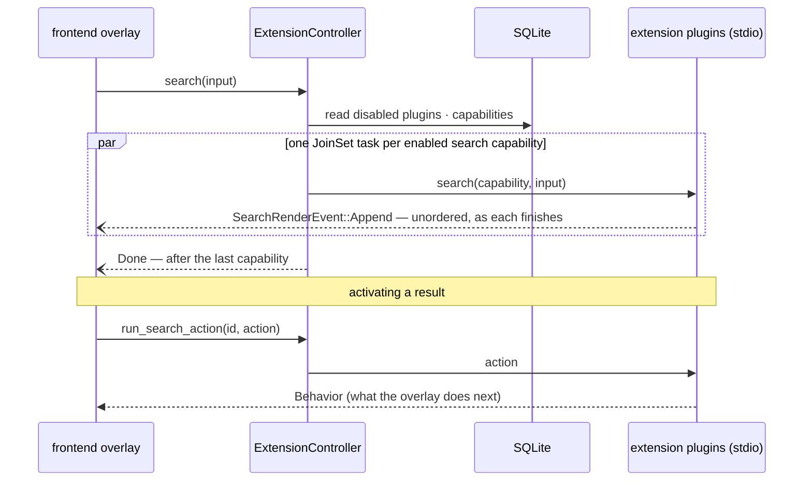
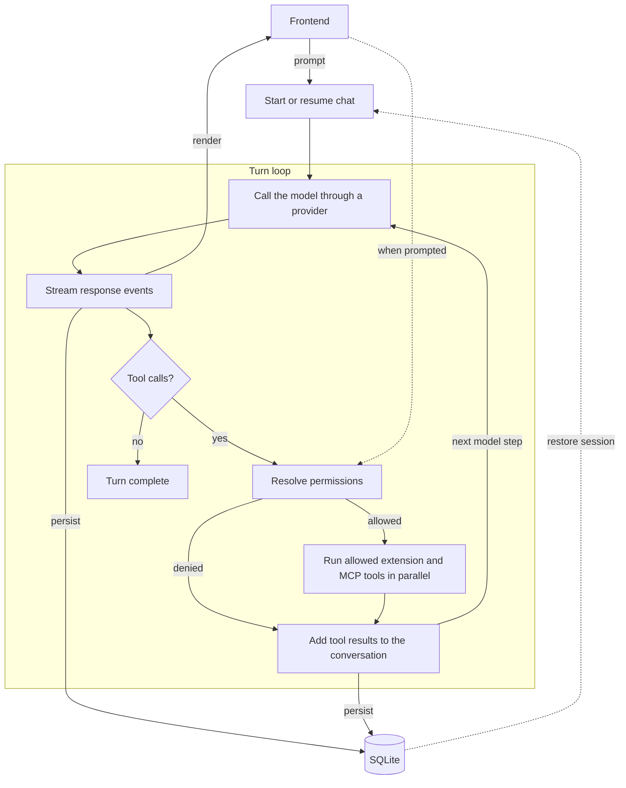
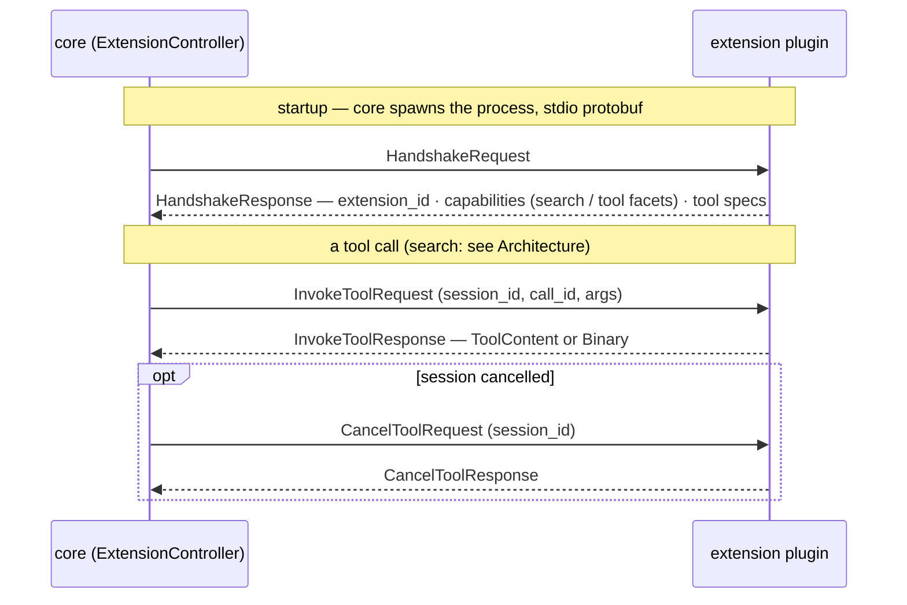
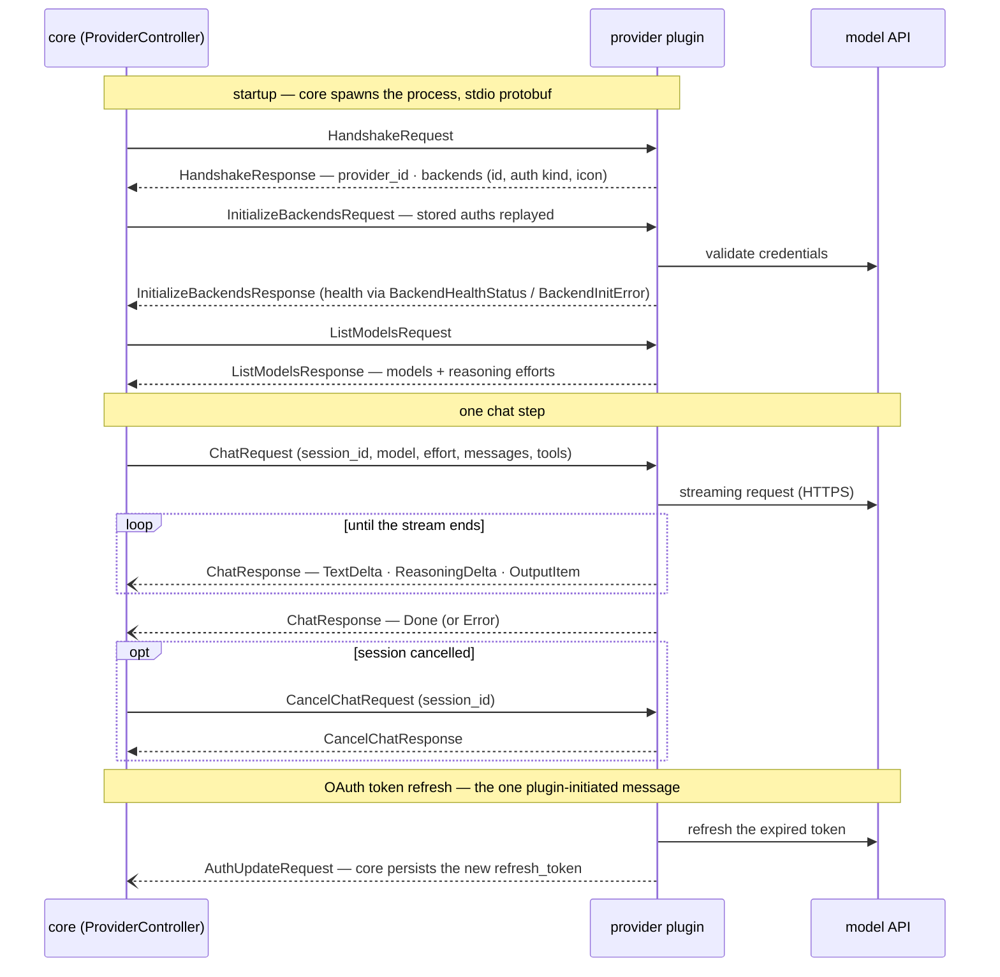
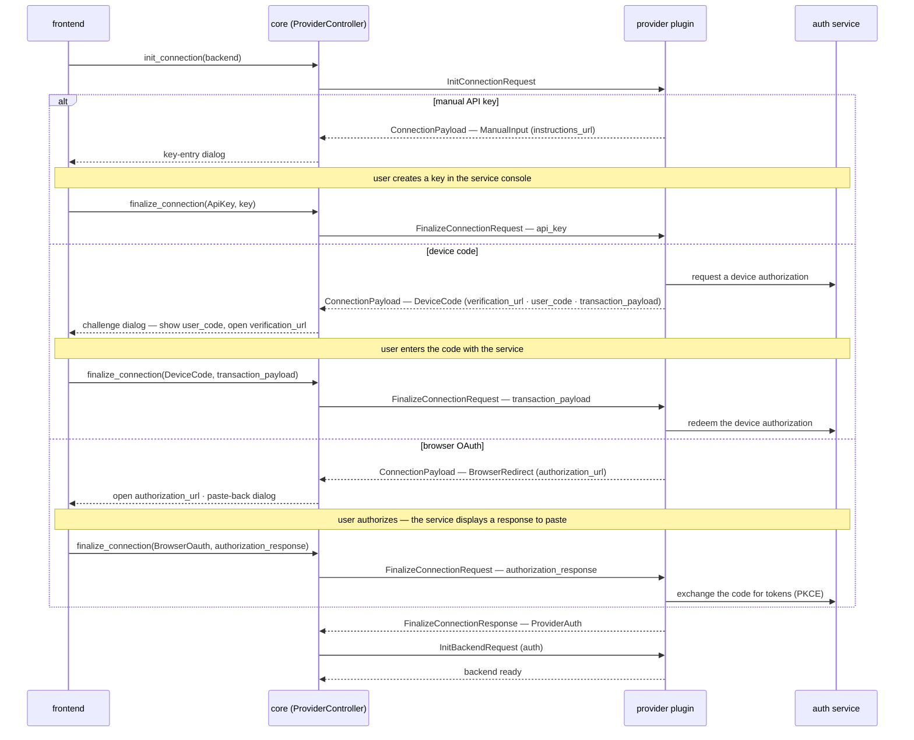
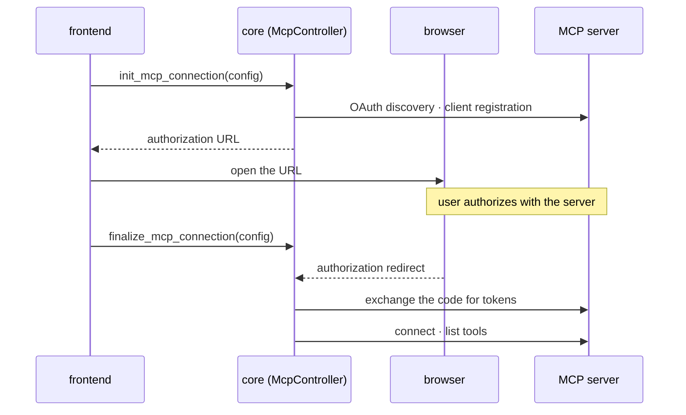
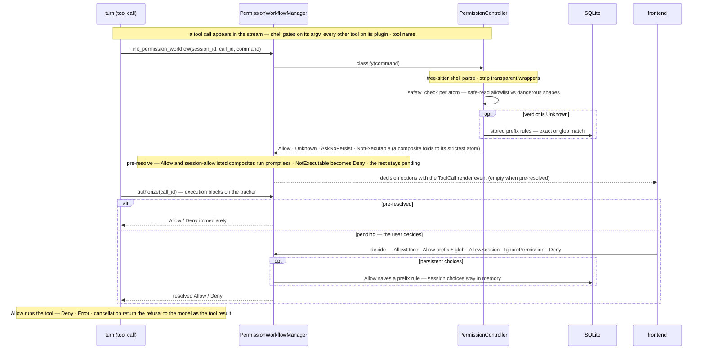

# Paloma Core

## Development

```sh
cargo test -p paloma-core     # unit + storage tests
cargo clippy -p paloma-core   # lint gate; clone lints are workspace warnings
```

## Architecture

### High Level Search Workflow:



### High Level Chat Workflow:



## Plugins

Core does not include any domain specific logic. Every model, search source,
and tool the app offers is served by a plugin. Plugins run outside the core
process, as child processes speaking varint-delimited protobuf
over stdio.

### Extensions

Extensions add functionality to both surfaces of the app: search and LLM
chat. An extension bundles one or more capabilities, and each capability can
act as a search source, as a tool available to the model, or as both. Every
extension speaks the same wire protocol, defined in
[`schema/extension`](../schema/extension). To write your own, see
[`webfetch`](../plugins/extensions/webfetch) for a complete reference
implementation.

#### Extension Call Flow



### Providers

Providers connect the app to LLM services. A provider bundles one or more
backends, each declared in the handshake with its unique id, description,
icon, and required auth method. Every provider speaks the same wire
protocol, defined in
[`schema/provider`](../schema/provider). Anthropic and OpenAI ship as
built-ins, served through the same re-exec mechanism as extensions; to
write your own, see [`deepseek`](../plugins/providers/deepseek) for a
complete reference implementation. Connecting a backend to an account is
covered in [Authentication → Providers](#providers-1).

#### Provider Call Flow



### MCPs

MCP servers internally are handled through the [`rmcp`](https://crates.io/crates/rmcp)
crate. MCPs will join the same catalogue and
permission gate as extension tools. Connecting a remote server
is covered in [Authentication → MCPs](#mcps-1).

## Authentication

Provider backends and protected remote MCP servers may require authentication.
Successful connections are saved and restored on future launches.

### Providers

Each backend supports one sign-in method: API key, device code, or browser
OAuth. The app presents the matching flow, and the provider plugin handles
authentication with the service. OAuth credentials refresh automatically.

#### Provider Auth Flow



### MCPs

> [!NOTE]
> OAuth requires the server to support Dynamic Client Registration. Servers
> that require pre-registered client credentials are not supported by `rmcp`.

Local servers and remote servers without authentication connect directly.
Protected remote servers use browser OAuth: the app opens the authorization
page and completes the connection after approval. OAuth credentials refresh
automatically.

#### MCP Auth Flow



## Permissions

Every extension and MCP tool call passes through the permission gate before it
runs. Shell calls are classified from their command line; other tools are
classified by plugin and tool name. Classification begins as soon as the call
appears in the model's response, so safe calls and calls covered by an existing
approval can proceed without prompting when execution starts.

Shell commands are parsed conservatively. Read-only commands may be allowed
automatically, while unsupported commands are denied. Pipelines and command
lists are judged by their strictest command; risky or ambiguous input always
requires an explicit decision and cannot create a persistent approval.

Pending calls wait for the user to allow or deny them. An ordinary command can
be allowed once or approved for future matching calls. Composite shell commands
can instead be approved for the current session. Saved approvals persist across
launches and can be removed from settings. A denied, invalid, or cancelled call
is not executed, and the outcome is returned to the model.

#### Permission Decision Flow


